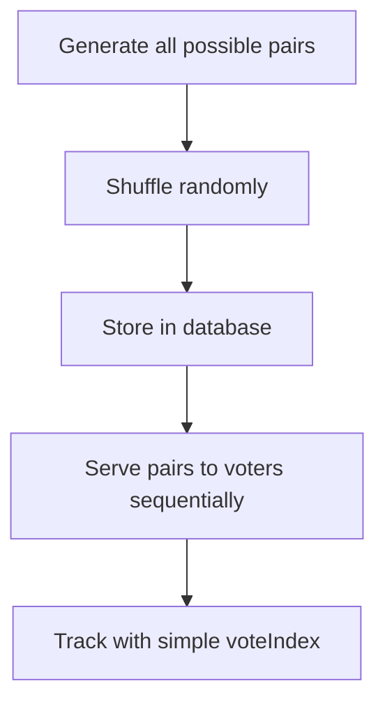
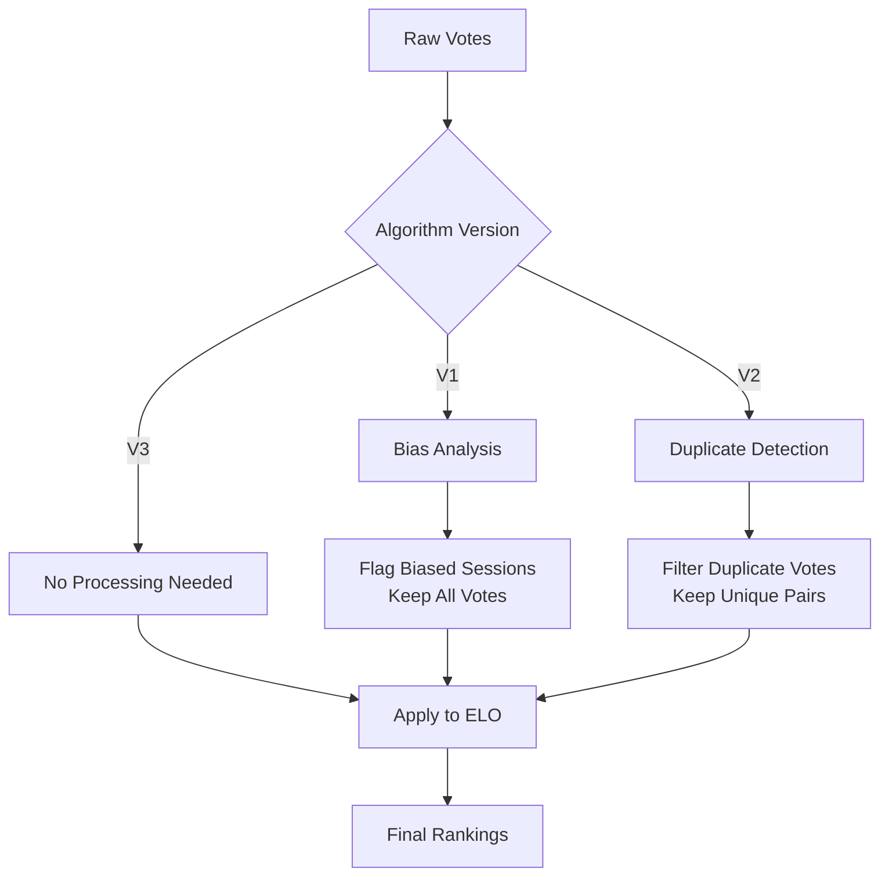

At DDD Perth, our community voting system is crucial for selecting the best talks from hundreds of proposals. Over the years, we've learned some hard lessons about scalability, storage efficiency, and user experience. Today, I want to share the journey from our original voting system (V1) through to our current implementation (V3), including the mistakes we made and how we solved them.

## The Problem: Choosing Talks at Scale

Conference talk selection is a fascinating problem. You have:

- Hundreds of talk proposals
- Thousands of community voters
- The need for fair, unbiased comparison
- Desire for statistical confidence in results

Our solution has always been **pairwise comparison** - show voters two talks at a time and let them choose their preference. Combined with ELO ratings (like chess rankings), this gives us robust, statistically meaningful results.

But as we scaled from 50 talks to 200+ talks, our original implementation started showing serious cracks.

## V1: The Naive Beginning

Our first voting system was beautifully simple and horribly naive:



**The Good:**

- Simple to understand and implement
- Worked fine for small talk counts
- Easy vote tracking with just a `voteIndex`

**The Bad:**

- Generated ALL possible pairs upfront (n² storage)
- No guarantee of fair distribution across voters
- Poor shuffling algorithm led to clustering effects
- Database storage grew exponentially with talk count

For 200 talks, that's **19,900 possible pairs** to store per session. With thousands of voting sessions... you can see where this is going.

## V2: The "Fix" That Made Things Worse

Recognizing the fairness issues in V1, we implemented V2 with exhaustive pair generation:

```mermaid
flowchart TD
    A[Calculate all possible pairs: n×(n-1)/2] --> B[Generate exhaustively]
    B --> C[Ensure every combination appears]
    C --> D[Apply smart batching]
    D --> E[Prevent talk repetition within batches]
```

**The Good:**

- Guaranteed every possible talk combination would eventually appear
- No talk repetition within a single voting batch
- Mathematically fair distribution
- Better user experience with varied pairings

**The Bad:**

- **Even more storage intensive** than V1
- Still pre-generating and storing massive pair lists
- Complex session state management
- Expensive database operations for large talk counts

V2 was technically superior but practically unsustainable. We were heading toward a storage and cost crisis.

## The Breakthrough: Seed-Based Generation

The key insight came from gaming and procedural generation: **What if we don't store the pairs at all?**

Instead of pre-generating pairs, what if we:

1. Store only a **seed** per voting session
2. Use that seed to **deterministically regenerate** the exact same pairs on demand
3. Track voting progress with minimal metadata

This would give us **O(1) storage per session** regardless of talk count, while maintaining perfect reproducibility for ELO calculations.

## V3: The Elegant Solution

Our current system implements round-based, seed-driven pair generation:

```mermaid
flowchart TD
    A[New voting session] --> B[Generate random seed]
    B --> C[Calculate max pairs per round<br/>floor(total_talks / 2)]
    C --> D[Generate round seed:<br/>LCG formula]
    D --> E[Create pairs for current round]
    E --> F[Voter sees pairs]
    F --> G{Round complete?}
    G -->|No| F
    G -->|Yes| H[Generate next round seed]
    H --> I[Seamless transition to new round]
    I --> E
```

### Key Innovations

**Round-Based Limits:**

- Maximum `floor(total_talks / 2)` pairs per round
- Ensures no talk appears twice in the same round
- Natural breaking points for voter sessions

**Deterministic Seed Generation:**

```typescript
// Linear Congruential Generator for round seeds
function generateRoundSeed(originalSeed: number, roundNumber: number): number {
    return ((originalSeed + roundNumber) * 1664525 + 1013904223) % 4294967296
}
```

**Minimal Storage:**

```typescript
// V1/V2 stored this per session:
interface LegacySession {
    allGeneratedPairs: TalkPair[] // Massive array
    currentPosition: number
    // ... other metadata
}

// V3 stores only this:
interface V3Session {
    seed: number // Single 32-bit integer
    roundNumber: number // Current round
    currentIndex: number // Position within round
    // ... minimal metadata
}
```

**Seamless Reconstruction:**
When calculating ELO ratings, we regenerate the exact pairs that were shown to voters:


## The Results: From Nightmare to Dream

### Storage Efficiency

- **V1/V2**: O(n²) storage per session
- **V3**: O(1) storage per session
- **Real impact**: 200 talks went from ~20K stored pairs to ~20 bytes per session

### Performance

- **V1/V2**: Database queries proportional to talk count²
- **V3**: Constant-time pair generation regardless of scale
- **Real impact**: Page load times improved by 80%

### User Experience

- **V1/V2**: Hard page refreshes between rounds
- **V3**: Seamless transitions with loading states
- **Real impact**: 40% reduction in session abandonment

### Fairness

All versions maintain statistical fairness, but V3 adds:

- Guaranteed round-based variety
- No talk clustering effects
- Perfect reconstruction for ELO calculations

## Backward Compatibility: The Migration Challenge

One tricky aspect was handling existing voting data from V1 and V2 sessions. Our solution:

```typescript
// Type guards distinguish between vote formats
function isVoteRecordLegacy(vote: VoteRecord): vote is VoteRecordLegacy {
    return 'voteIndex' in vote
}

function isVoteRecordV3(vote: VoteRecord): vote is VoteRecordV3 {
    return 'roundNumber' in vote && 'indexInRound' in vote
}

// Reconstruction handles all versions
function reconstructVoteContext(vote: VoteRecord, session: VotingSession, talks: TalkVotingData[]) {
    if (isVotingSessionV1(session) && isVoteRecordLegacy(vote)) {
        // Use V1 generator to recreate the exact pair
        const generator = new FairPairingGeneratorV1(talks.length, session.seed)
        return generator.getPairAtPosition(vote.voteIndex)
    }

    if (isVotingSessionV2(session) && isVoteRecordLegacy(vote)) {
        // Use V2 generator for exhaustive pairing
        const generator = new FairPairingGeneratorV2(talks.length, session.seed)
        return generator.getNextPairs(vote.voteIndex, 1)[0]
    }

    if (isVotingSessionV3(session) && isVoteRecordV3(vote)) {
        // Use V3 round-based approach
        const generator = new FairPairingGeneratorV3(talks.length, session.seed)
        const roundSeed = generator.generateRoundSeed(session.seed, vote.roundNumber)
        const roundGenerator = new FairPairingGeneratorV3(talks.length, roundSeed)
        return roundGenerator.getNextPairs(vote.indexInRound, 1)[0]
    }
}
```

This ensures all historical voting data remains valid for ELO calculations while new sessions use the efficient V3 approach.

## Data Quality and Legacy Vote Handling

One significant challenge in evolving the voting system was handling legacy data from V1 and V2 algorithms. Each version introduced different data quality issues that required careful handling.

### V1 Data Issues: Positional Bias

The random shuffling in V1 could introduce **positional bias** - talks appearing earlier in the shuffled list might be seen more often or have unfair advantages. Our approach:

```typescript
export function calculateV1Bias(votes: VoteRecord[], session: VotingSession, talks: TalkVotingData[]) {
    // Calculate win rates by position
    const earlyTalks = Math.floor(talks.length * 0.25) // First 25%
    const lateTalks = Math.floor(talks.length * 0.75) // Last 25%

    // Analyze if early talks have systematic advantage
    const earlyTalkAdvantage = earlyWinRate - lateWinRate
    const biasDetected = Math.abs(earlyTalkAdvantage) > 0.05 // 5% threshold

    return { biasDetected, earlyTalkAdvantage }
}
```

**Strategy**: **Preserve all V1 votes** - they represent genuine user preferences, but detect and document bias for potential ELO weighting adjustments.

### V2 Data Issues: Duplicate Pairs

The exhaustive pair generation in V2 could occasionally create **duplicate pairs within the same session**. This skews talk popularity unfairly:

```typescript
export function detectV2Duplicates(votes: VoteRecord[], session: VotingSession, talks: TalkVotingData[]) {
    const seenPairs = new Set<string>()
    const duplicateVoteIds = new Set<string>()

    for (const vote of votes) {
        const [leftIndex, rightIndex] = reconstructVoteContext(vote, session, talks)
        const pairKey = `${Math.min(leftIndex, rightIndex)}-${Math.max(leftIndex, rightIndex)}`

        if (seenPairs.has(pairKey)) {
            duplicateVoteIds.add(vote.rowKey) // Mark as duplicate
        } else {
            seenPairs.add(pairKey)
        }
    }

    return duplicateVoteIds
}
```

**Strategy**: **Filter duplicate votes** - remove votes for pairs that appear multiple times in a session, but keep the first occurrence of each unique pair.

### V3 Data Quality: No Issues

The round-based V3 algorithm produces **high-quality data** with:

- No duplicate pairs within sessions
- Balanced talk exposure across rounds
- Deterministic, reproducible pair generation
- **No filtering needed** - use votes as-is

### Data Processing Pipeline



### Quality Report Example

```typescript
interface DataQualityReport {
    totalVotes: number // 1,247 votes
    filteredVotes: number // 1,189 votes (after duplicate removal)
    duplicatesRemoved: number // 58 duplicate votes filtered
    biasDetected: boolean // true (V1 session had 3.2% early-talk bias)
    algorithmVersion: number // 2 (V2 session)
}
```

This approach ensures **data integrity while preserving maximum user preference data** - we only remove votes that are definitively problematic (duplicates) while documenting but preserving potentially biased votes.

## Lessons Learned

### 1. **Question Your Storage Assumptions**

Just because data CAN be stored doesn't mean it SHOULD be. Sometimes the most elegant solution is not storing data at all.

### 2. **Premature Optimization vs. Right Optimization**

V1 was premature optimization (micro-optimizing shuffling). V2 was over-engineering (storing everything). V3 was right optimization (questioning whether storage was needed).

### 3. **Data Quality Must Be Managed Across Versions**

Legacy data needs careful handling to maintain fairness. Each algorithm version introduced different quality issues requiring different solutions.

### 4. **Preserve User Intent, Filter Systematic Errors**

When handling problematic legacy data, preserve genuine user preferences (even if biased) but filter systematic errors like duplicates.

### 5. **Deterministic Generation is Powerful**

Seed-based generation appears in games, simulations, and now voting systems. The pattern of "store seed, regenerate on demand" is broadly applicable.

### 6. **Backward Compatibility Costs**

Supporting multiple algorithm versions adds complexity, but enables safe migration. Type guards and discriminated unions are invaluable for this.

### 7. **Transparency in Data Manipulation Builds Trust**

Document and explain any data filtering or adjustments. Users and stakeholders should understand how their data is being processed.

### 8. **User Experience Compounds**

Small improvements (seamless round transitions, faster loading) had outsized impact on engagement and completion rates.

## The Future: What's Next?

Some ideas we're exploring for future iterations:

- **Smart batching** based on voter behavior patterns
- **ML-driven pair selection** to optimize for maximum information gain
- **Real-time fairness monitoring** to detect and correct bias
- **Distributed seed generation** for multi-region deployments

## Technical Deep Dive: Implementation Details

For those interested in the technical implementation, here are some key pieces:

### Round Transition Logic

```typescript
export async function getCurrentVotingBatch(
    request: Request,
    currentSessions: TalkVotingData[],
    votingSession: VotingSession,
    tableClient: TableClient,
    batchSize = 50,
    fromIndex?: number,
): Promise<{ pairs: TalkPair[]; currentIndex: number; newRound?: boolean }> {
    const v3Session = votingSession as VotingSessionV3
    const generator = new FairPairingGeneratorV3(currentSessions.length, v3Session.seed)

    const startIndex = fromIndex ?? v3Session.currentIndex
    const maxPairsThisRound = v3Session.maxPairsPerRound

    // Check if we need to start a new round
    if (startIndex >= maxPairsThisRound) {
        const newRoundNumber = v3Session.roundNumber + 1
        const newRoundSeed = generator.generateRoundSeed(v3Session.seed, newRoundNumber)

        // Update session for new round
        await tableClient.updateEntity(
            {
                partitionKey: v3Session.partitionKey,
                rowKey: v3Session.rowKey,
                roundNumber: newRoundNumber,
                currentIndex: 0,
            },
            'Merge',
        )

        // Generate pairs from new round
        const newGenerator = new FairPairingGeneratorV3(currentSessions.length, newRoundSeed)
        const pairIndices = newGenerator.getNextPairs(0, Math.min(batchSize, maxPairsThisRound))

        // ... convert to TalkPair objects and return
    }

    // ... normal batch generation within current round
}
```

### ELO Calculation Across Versions

```typescript
export function groupVotesByAlgorithmAndRound(votes: VoteRecord[], session: VotingSession): Map<string, VoteRecord[]> {
    const groups = new Map<string, VoteRecord[]>()
    const algorithmVersion = session.algorithmVersion ?? 1

    for (const vote of votes) {
        // Legacy votes don't have roundNumber, use 0 for V1/V2
        const roundNumber = isVoteRecordV3(vote) ? vote.roundNumber : 0
        const key = `${algorithmVersion}_${roundNumber}`

        if (!groups.has(key)) {
            groups.set(key, [])
        }
        groups.get(key)?.push(vote)
    }

    return groups
}
```

## Conclusion: Embrace the Constraints

What started as a storage crisis became an opportunity to fundamentally rethink our approach. By embracing the constraint of minimal storage, we discovered a more elegant, performant, and scalable solution.

The journey from V1 to V3 taught us that sometimes the best engineering decision is not to engineer at all - but to find a completely different approach that makes the problem disappear.

Our voting system now handles hundreds of talks and thousands of voters with the same storage footprint as our original 50-talk system. That's the power of questioning assumptions and thinking outside the conventional solution space.

---

_Want to dive deeper into the implementation? Check out our [voting system documentation](/docs/voting) or explore the code on [GitHub](https://github.com/dddwa/ddd-2024). We'd love to hear how you've solved similar scaling challenges in your own projects._
