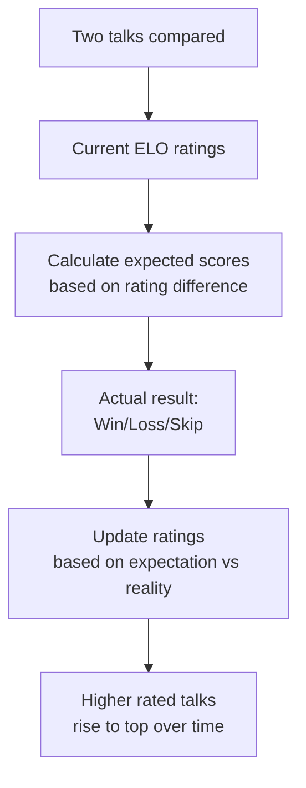
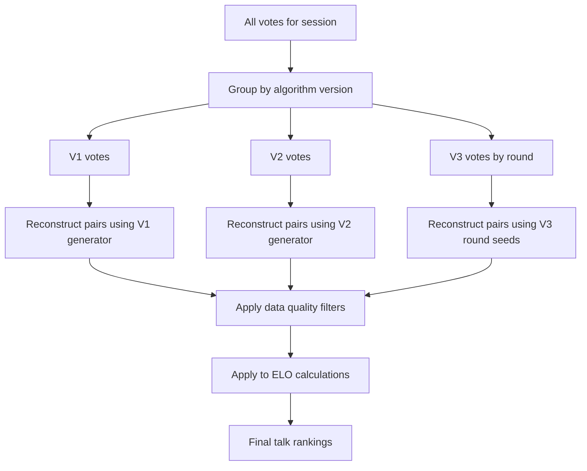
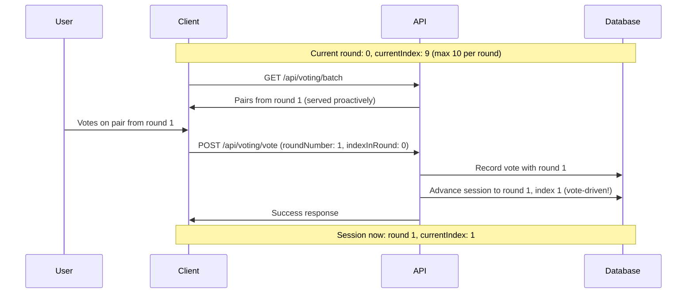

# DDD Perth Voting System

The DDD Perth conference uses a community voting system to help select talks from submitted proposals. This document explains how the voting system works, including the underlying algorithms and ELO rating calculations.

## Overview

The voting system presents pairs of talk proposals to voters, who choose which talk they prefer or skip the comparison. This pairwise comparison approach, combined with ELO ratings, provides a fair and statistically robust way to rank talks based on community preference.

## How Voting Works

### For Voters

1. **Start a Voting Session**: Visit `/voting` to begin
2. **Compare Talk Pairs**: You'll see two talk proposals side by side
3. **Make Your Choice**:
    - Click on the talk you prefer
    - Or click "Skip" if you can't decide or aren't familiar with the topics
4. **Continue Voting**: The system automatically loads the next pair
5. **Round-Based Progression**: After viewing all possible pairs in a round, you'll automatically start a new round with different pairings

### Talk Pair Generation

The system uses a simple algorithm to ensure fair comparison:

```mermaid
flowchart TD
    A[Voter starts session] --> B[Generate unique session seed]
    B --> C[Calculate max pairs per round<br/>floor(total_talks / 2)]
    C --> D[Generate round pairs using seed]
    D --> E[Present pairs to voter]
    E --> F{Round complete?}
    F -->|No| E
    F -->|Yes| G[Generate new round seed]
    G --> H[Start new round]
    H --> E
```

#### Key Principles

- **No talk repetition within a round**: Each talk appears at most once per round
- **Deterministic generation**: Same seed produces same pairs for consistency
- **Fair distribution**: All talks get equal opportunity for comparison over time
- **Stateless storage**: Only the session seed is stored, pairs are generated on-demand

## Algorithm Versions

The voting system has evolved through three versions:

### V1 (Legacy)

- Basic shuffling algorithm
- Simple pair generation
- Used `voteIndex` for vote tracking

### V2 (Legacy)

- Exhaustive pair generation ensuring all possible combinations
- Improved fairness over V1
- Still used `voteIndex` for vote tracking
- Generated permutations of pairs, ensuring pairs were not duplicated

### V3 (Current)

- **Round-based approach**: Limits pairs per round to `floor(total_talks / 2)`
- **Seed-based generation**: Deterministic round seeds using Linear Congruential Generator
- **Seamless round transitions**: Automatic progression without page refreshes
- **Vote tracking**: Uses `roundNumber` + `indexInRound` for precise vote reconstruction

## ELO Rating System

The voting system uses ELO ratings (similar to chess rankings) to calculate talk popularity and rankings.

### How ELO Works



### ELO Calculation Process

1. **Initial Rating**: All talks start with the same ELO rating (typically 1500)

2. **Expected Score Calculation**:

    ```
    Expected_A = 1 / (1 + 10^((Rating_B - Rating_A) / 400))
    Expected_B = 1 - Expected_A
    ```

3. **Actual Score Assignment**:

    - Winner gets 1 point, loser gets 0 points
    - Skipped comparisons are ignored (no rating change)

4. **Rating Update**:
    ```
    New_Rating_A = Rating_A + K * (Actual_A - Expected_A)
    New_Rating_B = Rating_B + K * (Actual_B - Expected_B)
    ```
    Where K is a constant (typically 32) that determines how much ratings change per game.

### Cross-Algorithm Compatibility

The system handles votes from different algorithm versions with data quality considerations:



### Data Quality and Manipulation

Due to the evolution of the voting algorithm, legacy data requires careful handling to maintain fair ELO calculations:

#### V1 Algorithm Issues

- **Problem**: Random shuffling introduced positional bias
- **Solution**: Include all V1 votes but apply bias correction
- **Rationale**: V1 votes represent genuine user preferences despite algorithmic bias

#### V2 Algorithm Issues

- **Problem**: Exhaustive generation could create duplicate pairs within sessions
- **Solution**: Filter out votes for duplicate pairs, keep unique votes
- **Rationale**: Duplicate votes skew talk popularity unfairly

#### V3 Algorithm (Current)

- **Quality**: High-quality, round-based generation with no duplicates
- **Processing**: Use votes as-is without filtering

### Data Processing Pipeline

1. **Vote Reconstruction**: Generate original pairs using version-specific algorithms
2. **Duplicate Detection**: Identify problematic votes (V2 duplicates)
3. **Bias Analysis**: Calculate positional bias metrics (V1)
4. **Data Filtering**: Remove or weight problematic votes
5. **ELO Application**: Apply cleaned votes to rating calculations

### ELO Benefits

- **Relative Rankings**: Shows which talks are preferred over others
- **Statistical Significance**: More votes = more confident ratings
- **Handles Skill Gaps**: Large rating differences mean predictable outcomes
- **Self-Correcting**: Incorrect initial assumptions get corrected over time

## Technical Implementation

### Session Management

Each voting session generates:

- **Unique Session ID**: Tracks individual voter sessions
- **Deterministic Seed**: Ensures consistent pair generation
- **Round Tracking**: Current round number and position within round

### Vote Storage

Votes are stored with minimal data:

- **V1/V2 (Legacy)**: `voteIndex` + choice + timestamp
- **V3 (Current)**: `roundNumber` + `indexInRound` + choice + timestamp

### Pair Reconstruction

When calculating results, the system:

1. Groups votes by algorithm version and round
2. Uses the original session seed to regenerate the exact pairs that were voted on
3. Applies votes to ELO calculations in chronological order
4. Produces final talk rankings

## Storage Efficiency

The V3 system's key innovation is storage efficiency:

**Traditional Approach (V1/V2)**:

- Store every generated pair in database
- Large storage requirement: O(n²) for n talks
- Complex session management

**V3 Seed-Based Approach**:

- Store only: session seed + round number + vote positions
- Minimal storage: O(1) per session regardless of talk count
- Deterministic pair reconstruction when needed

This approach scales efficiently even with hundreds of talks and thousands of voting sessions.

## Fairness Guarantees

The system ensures fairness through:

1. **Equal Opportunity**: Each talk appears in similar numbers of comparisons over time
2. **No Repetition**: Within a round, no talk appears more than once
3. **Random Distribution**: Seed-based generation provides pseudo-random but fair pairing
4. **Cross-Round Variety**: Different rounds show different pairings for the same talks

## API Endpoints

### GET `/api/voting/batch`

Retrieves the next batch of talk pairs for voting.

**Query Parameters**:

- `clientVersion`: Must be 'v3' for current implementation
- `fromRound`: Starting round number for batch
- `fromIndex`: Starting index within round for batch

**Response**:

```json
{
    "pairs": [
        {
            "index": 0,
            "roundNumber": 0,
            "left": { "id": "123", "title": "Talk A", "description": "...", "tags": ["..."] },
            "right": { "id": "456", "title": "Talk B", "description": "...", "tags": ["..."] }
        }
    ],
    "currentIndex": 1,
    "newRound": false
}
```

### POST `/api/voting/vote`

Records a vote for a talk pair.

**Request Body**:

```json
{
    "vote": "A", // "A", "B", or "skip"
    "roundNumber": 0, // Round number from the pair being voted on
    "indexInRound": 0,
    "clientVersion": "v3"
}
```

Both endpoints automatically handle round transitions and ensure backward compatibility by redirecting outdated client versions.

## Concurrency and Race Conditions

### Session Index Updates

Due to network latency and rapid voting, multiple votes for the same session can arrive out of order. The system uses **optimistic concurrency control** to handle this safely:

```typescript
async function updateSessionIndexSafely(
    votesTableClient: TableClient,
    sessionId: SessionId,
    voteRoundNumber: number,
    newCurrentIndex: number,
    maxRetries = 5,
): Promise<void> {
    // Fetch current session with ETag
    const sessionEntity = await votesTableClient.getEntity(partitionKey, rowKey)

    // Only update if:
    // 1. Still in same round as the vote
    // 2. New index is higher (no going backwards)
    if (voteRoundNumber === currentRoundNumber && newCurrentIndex > currentIndex) {
        // Use ETag for atomic update
        await votesTableClient.updateEntity(updatedSession, 'Merge', {
            etag: sessionEntity.etag,
        })
    }
}
```

### Race Condition Protection

The system protects against several race conditions:

1. **Out-of-order votes**: Votes from earlier pairs arriving after later pairs
2. **Round transitions**: Votes arriving after a new round has started
3. **Concurrent updates**: Multiple votes updating the same session simultaneously

### Retry Strategy

- **Exponential backoff** with random jitter to prevent thundering herd
- **Maximum 5 retries** before giving up gracefully
- **Votes are never lost** - even if session index update fails, the vote is recorded
- **Graceful degradation** - session tracking may be slightly behind but remains consistent

## Round Transitions and User Experience

### Vote-Driven Round Advancement

Round transitions are triggered **only by actual voting**, never by page refreshes or batch fetching:



### Seamless Pair Generation

When users reach the end of a round, the system:

1. **Generates pairs from next round** without advancing session state
2. **Returns pairs with correct round numbers** for vote recording
3. **Advances session state only when votes are cast**

This ensures:

- ✅ Users never see empty batches or get stuck
- ✅ Page refreshes never skip content
- ✅ Round advancement tied to actual progress
- ✅ Seamless user experience across round boundaries

### Browser Refresh Safety

```typescript
// Safe: Page refresh never advances rounds
GET /api/voting/batch → Returns pairs from current position
// Only voting advances rounds
POST /api/voting/vote → May advance round in session if last pair in round
```

**Before fix**: Page refresh could skip pairs if user was at round boundary  
**After fix**: Page refresh always returns pairs from current position
